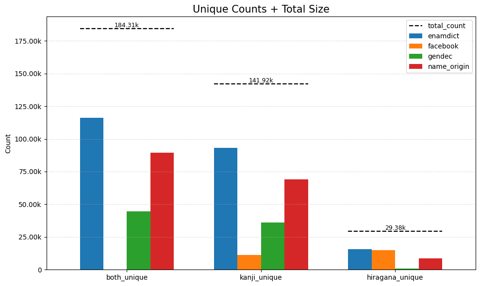
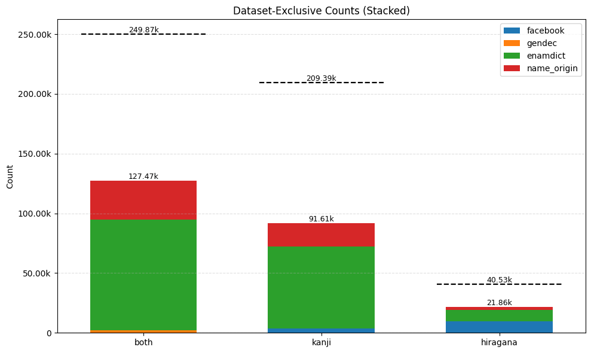

# 日本人名前データ

4つのデータセットから作成されています。
420k件全てに性別データがあり、6割のデータは漢字とひらがな両方揃っています。

| dataset     | size | 割合 | 男性割合 | ソース                                                                                                                  | repo                                                                                                       | note                         |
| ----------- | ---- | ---- | -------- | ----------------------------------------------------------------------------------------------------------------------- | ---------------------------------------------------------------------------------------------------------- | ---------------------------- |
| facebook    | 150k | 36%  | 57.2%    | [facebook5.3億人漏洩データ](https://www.theguardian.com/technology/2021/apr/03/500-million-facebook-users-website-hackers) | **[philipperemy/name-dataset](https://github.com/philipperemy/name-dataset)**                           | 漢字orひらがな　どちらかのみ |
| enamdict    | 116k | 28%  | 16.4%    | [ENAMDICT/JMnedict](https://www.edrdg.org/enamdict/enamdict_doc.html)                                                      | **[rgamici/japanese-names](https://github.com/rgamici/japanese-names)**                                 | 重複なし                     |
| name_origin | 90k  | 21%  | 60.4%    | [名前由来](https://myoji-yurai.net/prefectureRanking.htm)                                                                  | [shuheilocale/japanese-personal-name-dataset](https://github.com/shuheilocale/japanese-personal-name-dataset) | 重複なし                     |
| gendec      | 64k  | 15%  | 49.8%    | [shuheilocale/japanese-personal-name-dataset](https://github.com/shuheilocale/japanese-personal-name-dataset)              | [tarudesu/gendec-dataset](https://huggingface.co/datasets/tarudesu/gendec-dataset)                            | 研究目的のみ                 |

## 重複

gendecはname_originのうちの頻出データであるため使用はおすすめしないが何故か2.2kの非重複データ(kanji*hiragana)を持つ。

### 各データセット内のunique

| dataset     | total_count | kanji_unique | hiragana_unique | both_unique |
| :---------- | ----------: | -----------: | --------------: | ----------: |
| all         |      419349 |       141922 |           29377 |      184311 |
| enamdict    |      116009 |        93176 |           15810 |      116009 |
| facebook    |      149566 |        11240 |           15024 |           0 |
| gendec      |       64139 |        35974 |             934 |       44429 |
| name_origin |       89635 |        69002 |            8759 |       89435 |

### facebookを除く 漢字またひらがなが同一の重複

| dataset     | gendec_dup | enamdict_dup | name_origin_dup | total_dup |        non_dup |
| :---------- | ---------: | -----------: | --------------: | --------: | -------------: |
| gendec      |          0 |         8763 |           42091 |     42134 | **2295** |
| enamdict    |       8763 |            0 |           23428 |     23471 |          92538 |
| name_origin |      42091 |        23428 |               0 |     56799 |          32636 |

### 各datasetのみが所有するunique

| dataset     |   both |   kanji |   hiragana |
|:------------|-------:|--------:|-----------:|
| facebook    |      0 |    3565 |       9887 |
| gendec      |   2295 |     216 |          5 |
| enamdict    |  92538 |   68411 |       9384 |
| name_origin |  32636 |   19423 |       2585 |